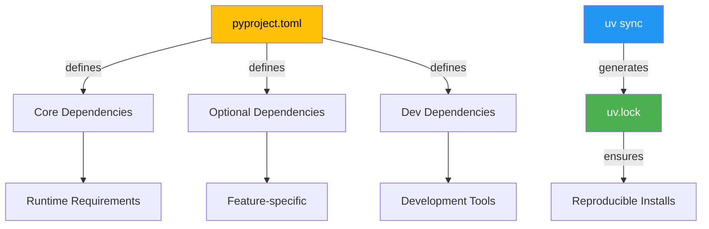
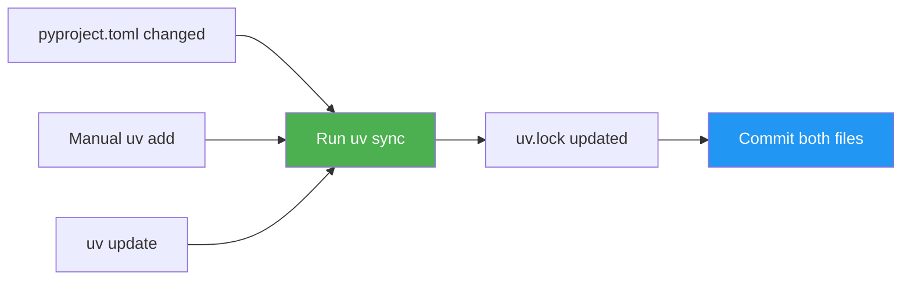

# Dependency Maintenance Guide for Astrabot

## Overview

With the consolidated setup using `pyproject.toml` and `uv`, dependency management is streamlined and consistent. This guide explains how to maintain dependencies throughout the project lifecycle.

## Dependency Structure



## Adding Dependencies

### 1. **Add Runtime Dependencies**

```bash
# Add a single package
just uv-add pandas

# Add with version constraint
just uv-add "pandas>=2.0.0"

# Or directly with uv
uv add pandas
```

### 2. **Add Development Dependencies**

```bash
# Add to dev group
uv add --dev pytest-xdist

# Add to specific optional group
uv add --optional vision pillow
```

### 3. **Add Optional Dependencies**

```toml
# In pyproject.toml
[project.optional-dependencies]
vision = ["openai>=1.0.0", "anthropic>=0.7.0"]
cuda118 = ["torch==2.7.1+cu118"]
experimental = ["new-package>=0.1.0"]
```

## Updating Dependencies

### 1. **Update Specific Package**

```bash
# Update single package
uv add --upgrade pandas

# Update to specific version
uv add "pandas==2.1.0"
```

### 2. **Update All Dependencies**

```bash
# Update all packages to latest compatible versions
just uv-update
# Or: uv sync --upgrade
```

### 3. **Update Lock File Only**

```bash
# Refresh lock file without changing installed packages
uv lock
```

## Version Management Strategy

### Semantic Versioning

```toml
# pyproject.toml examples
dependencies = [
    "pandas>=2.0.0",          # Minimum version
    "numpy>=1.24.0,<2.0",     # Version range
    "torch>=2.0.0",           # Flexible
    "pydantic==2.5.0",        # Pinned exactly
    "requests~=2.31.0",       # Compatible release (~=2.31.x)
]
```

### Best Practices

1. **Core Dependencies**: Use minimum version constraints
2. **Security-Critical**: Pin major versions
3. **Development Tools**: More flexible versioning
4. **ML Libraries**: Consider compatibility carefully

## Lock File Management

### Understanding uv.lock

- **Auto-generated**: Created/updated by `uv sync`
- **Committed to Git**: Ensures reproducible builds
- **Complete Graph**: Contains all transitive dependencies

### When Lock File Updates



## Maintenance Workflows

### 1. **Regular Updates (Weekly/Monthly)**

```bash
# Check for outdated packages
uv pip list --outdated

# Update all dependencies
just uv-update

# Run tests
just test

# Commit if tests pass
git add pyproject.toml uv.lock
git commit -m "chore: update dependencies"
```

### 2. **Security Updates (As Needed)**

```bash
# Check for security vulnerabilities
pip-audit  # Install separately if needed

# Update specific vulnerable package
uv add --upgrade vulnerable-package

# Verify fix
pip-audit
```

### 3. **Adding New Features**

```bash
# 1. Add required packages
uv add new-package another-package

# 2. Test locally
just test

# 3. Update documentation
# Document new dependencies in README if significant

# 4. Commit changes
git add pyproject.toml uv.lock
git commit -m "feat: add new-package for feature X"
```

## Dependency Groups

### Core Dependencies

Always installed:

```toml
dependencies = [
    "torch>=2.0.0",
    "transformers>=4.30.0",
    "pandas>=2.0.0",
]
```

### Optional Groups

Installed with extras:

```bash
# Install with vision support
uv sync --extra vision

# Install with all extras
uv sync --all-extras

# Install dev dependencies
uv sync --dev
```

### Group Organization

```toml
[project.optional-dependencies]
# Feature-specific
vision = ["openai>=1.0.0", "anthropic>=0.7.0"]
audio = ["whisper>=1.0.0", "soundfile>=0.12.0"]

# Environment-specific
cuda118 = ["torch==2.7.1+cu118"]
cuda121 = ["torch==2.7.1+cu121"]

# Development stages
experimental = ["unstable-package>=0.1.0a1"]
```

## CI/CD Integration

### GitHub Actions Example

```yaml
- name: Set up Python
  uses: actions/setup-python@v4
  with:
    python-version: "3.11"

- name: Install uv
  run: |
    curl -LsSf https://astral.sh/uv/install.sh | sh
    echo "$HOME/.local/bin" >> $GITHUB_PATH

- name: Install dependencies
  run: |
    uv sync --dev

- name: Run tests
  run: |
    source .venv/bin/activate
    pytest
```

### Pre-commit Integration

The `.pre-commit-config.yaml` includes:

```yaml
- repo: https://github.com/astral-sh/uv-pre-commit
  rev: 0.4.18
  hooks:
    - id: uv-lock
      name: Update uv.lock
      files: ^pyproject\.toml$
```

## Troubleshooting

### Dependency Conflicts

```bash
# Show dependency tree
uv pip tree

# Find why package is required
uv pip show package-name
```

### Reset Dependencies

```bash
# Clean and reinstall
rm -rf .venv uv.lock
just install-dev
```

### Platform-Specific Issues

```toml
# Handle platform-specific dependencies
dependencies = [
    "windows-curses>=2.0; platform_system == 'Windows'",
    "pyobjc>=9.0; platform_system == 'Darwin'",
]
```

## Best Practices

1. **Always Commit Lock File**: Both `pyproject.toml` and `uv.lock`
2. **Test After Updates**: Run full test suite after dependency changes
3. **Document Major Changes**: Note significant dependency changes in CHANGELOG
4. **Review Security Alerts**: Regularly check for vulnerable dependencies
5. **Use Dependency Groups**: Organize optional dependencies logically
6. **Pin Critical Versions**: For production, consider pinning critical dependencies
7. **Regular Maintenance**: Schedule monthly dependency updates

## Quick Reference

```bash
# Common commands
just uv-add package       # Add new dependency
just uv-remove package    # Remove dependency
just uv-update           # Update all dependencies
just uv-sync             # Sync with lock file

# Check status
uv pip list              # List installed packages
uv pip tree              # Show dependency tree
uv pip show package      # Show package details

# Advanced
uv add --dev package     # Add dev dependency
uv add --optional vision package  # Add to optional group
uv sync --extra vision   # Install with optional group
```
