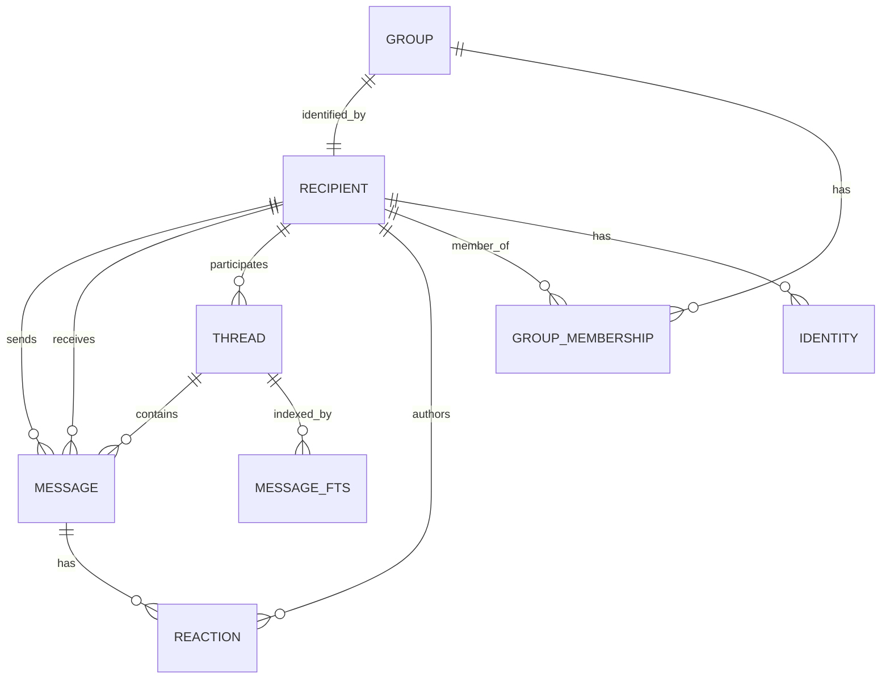

# Signal Data Schema Reference

This document provides a comprehensive reference for the Signal backup data schema after extraction to CSV format. Understanding these schemas is essential for working with the Astrabot conversation processing pipeline.

## Table of Contents
- [Overview](#overview)
- [Primary Tables](#primary-tables)
- [Data Relationships](#data-relationships)
- [Field Reference](#field-reference)
- [Data Types and Enumerations](#data-types-and-enumerations)
- [Privacy and Security Considerations](#privacy-and-security-considerations)
- [Usage Examples](#usage-examples)

## Overview

Signal backup files are SQLite databases that get exported to CSV format during the extraction process. The data model represents a complete messaging system with support for:
- Individual and group conversations
- Text messages, media attachments, and reactions
- Contact information and cryptographic identities
- Read receipts and delivery status
- Full-text search indexing

## Primary Tables

### Core Messaging Tables
1. **signal.csv** - All messages (109K+ rows typical)
2. **recipient.csv** - Contacts, groups, and system entities (1K+ rows)
3. **thread.csv** - Conversation threads (100s of rows)

### Supporting Tables
4. **reaction.csv** - Emoji reactions to messages
5. **groups.csv** - Group chat metadata
6. **group_membership.csv** - Group member mappings
7. **message_fts.csv** - Full-text search index
8. **identities.csv** - Cryptographic identity keys

## Data Relationships



### Key Relationships
- Messages belong to threads via `thread_id`
- Messages reference senders via `from_recipient_id`
- Messages reference receivers via `to_recipient_id`
- Threads reference their recipient via `recipient_id`
- Reactions reference messages via `message_id`
- Groups are recipients with `type=2`

## Field Reference

### signal.csv (Messages)

| Field | Type | Description | Privacy Level |
|-------|------|-------------|---------------|
| _id | INTEGER | Primary key | Low |
| date_sent | INTEGER | Unix timestamp when sent | Medium |
| date_received | INTEGER | Unix timestamp when received | Medium |
| date_server | INTEGER | Server timestamp | Medium |
| thread_id | INTEGER | FK to thread.csv | Low |
| from_recipient_id | INTEGER | FK to recipient.csv (sender) | High |
| to_recipient_id | INTEGER | FK to recipient.csv (receiver) | High |
| type | INTEGER | Message type code (see enums) | Low |
| body | TEXT | Message content | Critical |
| read | INTEGER | Read status (0/1) | Medium |
| quote_id | INTEGER | Referenced message ID | Low |
| quote_author | INTEGER | FK to recipient (quoted author) | High |
| quote_body | TEXT | Quoted message preview | High |
| server_guid | TEXT | Unique server identifier | Low |
| mentions_self | INTEGER | Mentioned in group (0/1) | Medium |
| remote_deleted | INTEGER | Deleted by sender (0/1) | Medium |

### recipient.csv (Contacts/Groups)

| Field | Type | Description | Privacy Level |
|-------|------|-------------|---------------|
| _id | INTEGER | Primary key | Low |
| type | INTEGER | Recipient type (0=individual, 2=group) | Low |
| e164 | TEXT | Phone number (E.164 format) | Critical |
| aci | TEXT | Account identifier (UUID) | High |
| pni | TEXT | Phone number identifier | High |
| username | TEXT | Signal username | High |
| blocked | INTEGER | Blocked status (0/1) | Medium |
| profile_given_name | TEXT | Signal profile first name | Critical |
| profile_family_name | TEXT | Signal profile last name | Critical |
| system_given_name | TEXT | Phone contact first name | Critical |
| system_family_name | TEXT | Phone contact last name | Critical |
| registered | INTEGER | Signal registration (0/1/2) | Low |

### thread.csv (Conversations)

| Field | Type | Description | Privacy Level |
|-------|------|-------------|---------------|
| _id | INTEGER | Primary key | Low |
| recipient_id | INTEGER | FK to recipient.csv | High |
| date | INTEGER | Last activity timestamp | Medium |
| meaningful_messages | INTEGER | Count of non-system messages | Low |
| read | INTEGER | Read status (0/1) | Medium |
| snippet | TEXT | Last message preview | High |
| snippet_type | INTEGER | Type of snippet content | Low |
| unread_count | INTEGER | Number of unread messages | Medium |
| archived | INTEGER | Archive status (0/1) | Low |
| pinned_order | INTEGER | Pin position (NULL if not pinned) | Low |

### reaction.csv (Message Reactions)

| Field | Type | Description | Privacy Level |
|-------|------|-------------|---------------|
| _id | INTEGER | Primary key | Low |
| message_id | INTEGER | FK to signal.csv | Low |
| author_id | INTEGER | FK to recipient.csv | High |
| emoji | TEXT | Reaction emoji | Low |
| date_sent | INTEGER | Unix timestamp sent | Medium |
| date_received | INTEGER | Unix timestamp received | Medium |

### groups.csv (Group Information)

| Field | Type | Description | Privacy Level |
|-------|------|-------------|---------------|
| _id | INTEGER | Primary key | Low |
| group_id | TEXT | Unique group identifier | Medium |
| recipient_id | INTEGER | FK to recipient.csv | High |
| title | TEXT | Group name | High |
| active | INTEGER | Active status (0/1) | Low |
| master_key | BLOB | Encrypted group key | Critical |
| decrypted_group | BLOB | Group metadata (encrypted) | High |

## Data Types and Enumerations

### Message Types (signal.csv.type)
```python
class MessageType(IntEnum):
    INCOMING_TEXT = 10485780
    OUTGOING_TEXT = 10485783
    INCOMING_MEDIA = 10485781
    OUTGOING_MEDIA = 10485784
    SYSTEM_MESSAGE = 10485785
    GROUP_UPDATE = 10485786
    CALL_HISTORY = 10485787
```

### Recipient Types (recipient.csv.type)
```python
class RecipientType(IntEnum):
    INDIVIDUAL = 0
    GROUP = 2
    DISTRIBUTION_LIST = 4
```

### Registration Status (recipient.csv.registered)
```python
class RegistrationStatus(IntEnum):
    NOT_REGISTERED = 0
    REGISTERED = 1
    DE_REGISTERED = 2
```

### Special Recipient IDs
- **ID 1**: Usually reserved (unused)
- **ID 2**: Backup owner (yourself)
- **ID 3**: Signal system messages
- **ID 4+**: Regular contacts and groups

## Privacy and Security Considerations

### Critical Data (Highest Privacy)
- Message content (`body` fields)
- Phone numbers (`e164`)
- Contact names (all name fields)
- Cryptographic keys

### High Privacy Data
- User/group identifiers (`aci`, `pni`)
- Social connections (group memberships)
- Message metadata (who talked to whom)

### Medium Privacy Data
- Timestamps (communication patterns)
- Read receipts and delivery status
- Blocked contact status

### Handling Sensitive Data
1. **Never log** phone numbers or message content
2. **Mask identifiers** in debug output
3. **Encrypt exports** containing personal data
4. **Limit access** to processed datasets
5. **Anonymize** training data when possible

## Usage Examples

### Finding All Messages in a Conversation
```python
# Get all messages between you and a specific contact
thread_id = thread_df[thread_df['recipient_id'] == contact_id]['_id'].iloc[0]
messages = signal_df[signal_df['thread_id'] == thread_id].sort_values('date_sent')
```

### Identifying Your Own Messages
```python
# Your recipient ID is typically 2
MY_RECIPIENT_ID = 2
my_messages = signal_df[signal_df['from_recipient_id'] == MY_RECIPIENT_ID]
```

### Getting Contact Names
```python
def get_contact_name(recipient_id):
    recipient = recipient_df[recipient_df['_id'] == recipient_id].iloc[0]
    # Prefer profile name, fall back to system contact name
    given = recipient['profile_given_name'] or recipient['system_given_name']
    family = recipient['profile_family_name'] or recipient['system_family_name']
    return f"{given} {family}".strip() or f"Contact {recipient_id}"
```

### Finding Group Messages
```python
# Get all group threads
group_threads = thread_df[
    thread_df['recipient_id'].isin(
        recipient_df[recipient_df['type'] == 2]['_id']
    )
]
```

### Extracting Reactions
```python
# Get all reactions for a message
message_reactions = reaction_df[reaction_df['message_id'] == message_id]
for _, reaction in message_reactions.iterrows():
    reactor = get_contact_name(reaction['author_id'])
    print(f"{reactor} reacted with {reaction['emoji']}")
```

## See Also
- [Conversation Processing Guide](../how-to/process-conversations.md)
- [Privacy Best Practices](../explanation/privacy-architecture.md)
- [Training Data Creation](../reference/api/training-data-creator.md)